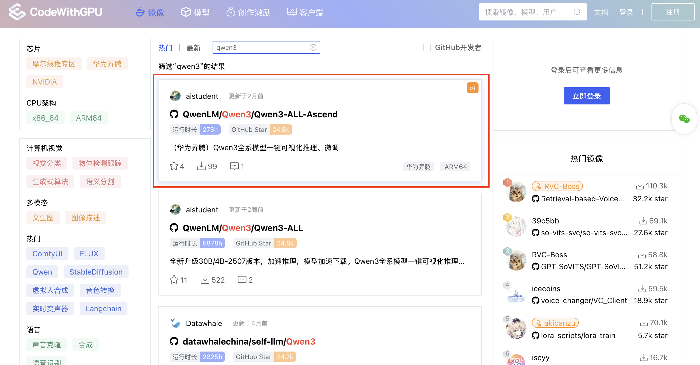
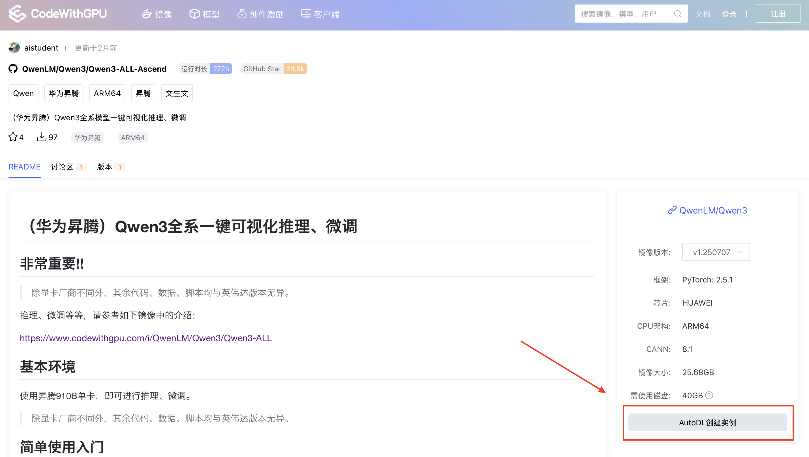
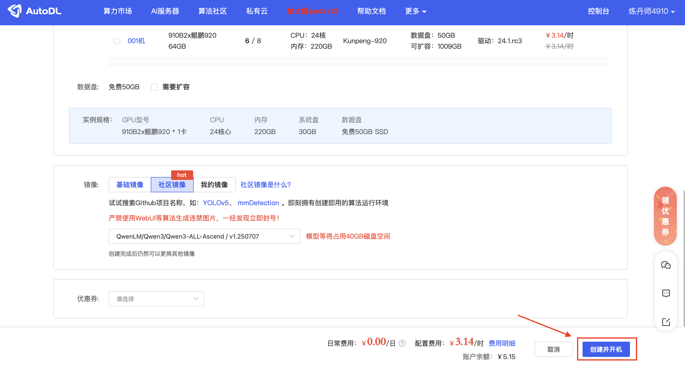
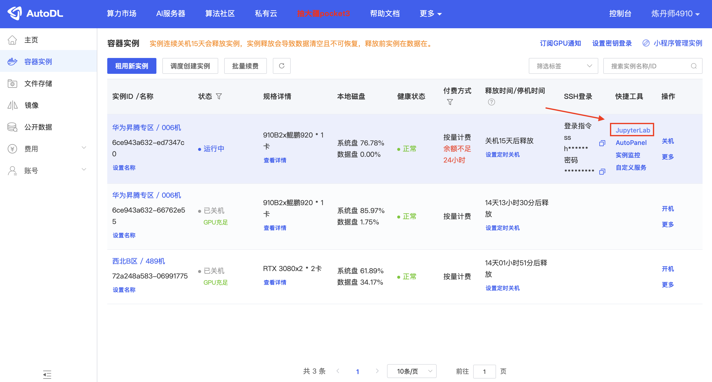
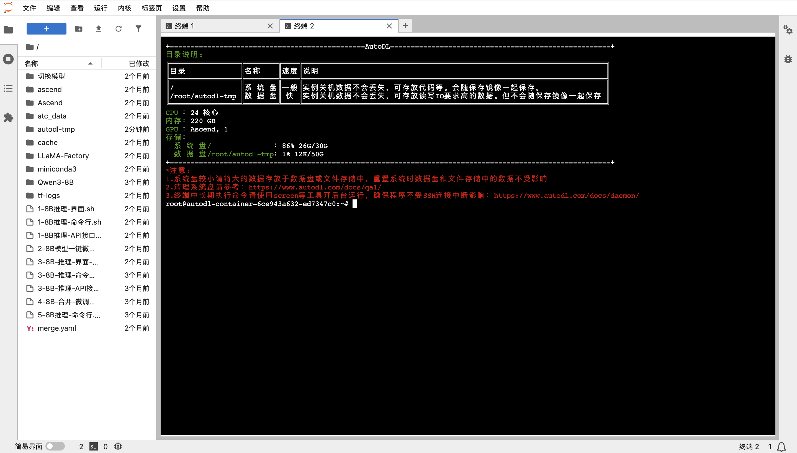
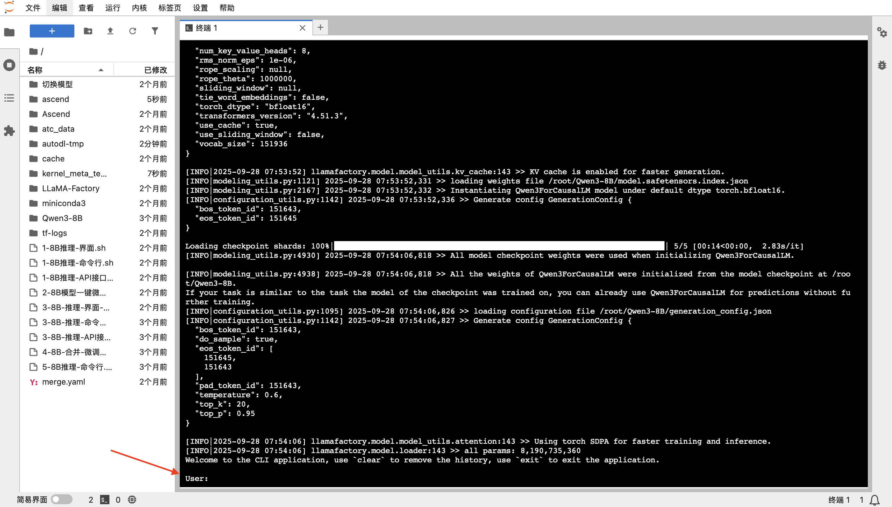
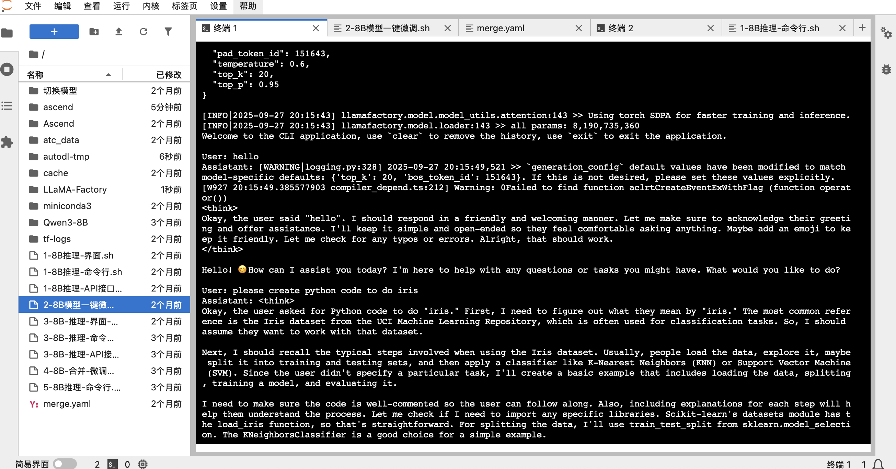
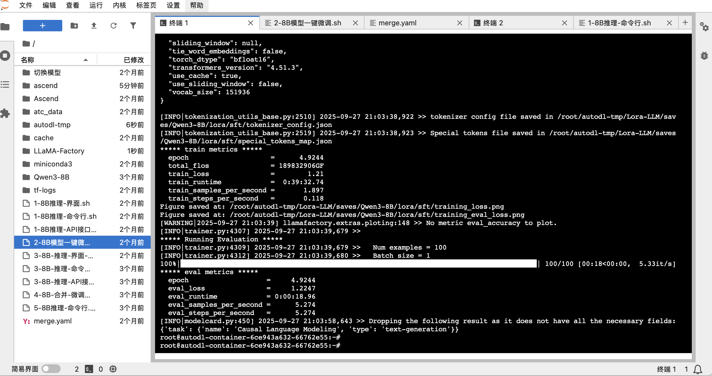
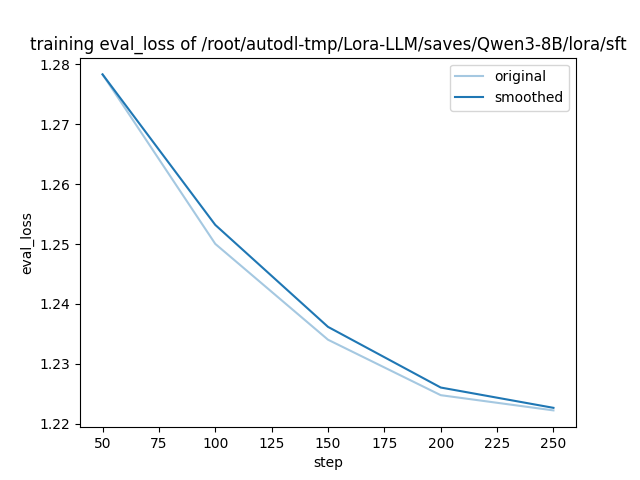

# Tutorial de Fine-tuning e Inferencia de Qwen3-8B en la Plataforma Huawei Ascend (Basado en AutoDL)

[English](README.md) | [简体中文](README.zh-CN.md) | [日本語](README.ja.md) | [Español](README.es.md) | [Français](README.fr.md)

Esta es una guía práctica completa diseñada para ayudar a desarrolladores y entusiastas de la IA a completar fácilmente la inferencia y el fine-tuning LoRA del modelo Qwen3-8B en la plataforma AutoDL utilizando hardware Huawei Ascend.

Utilizaremos la imagen [Qwen3-ALL-Ascend](https://www.codewithgpu.com/i/QwenLM/Qwen3/Qwen3-ALL-Ascend) empaquetada por el colaborador de la comunidad **aistudent**, que integra todos los entornos y scripts necesarios, logrando verdaderamente un "inicio con un clic".

---

## Tabla de Contenidos
1. [Configuración del Entorno: Creación de Instancia Ascend con Un Clic](#1-configuración-del-entorno-creación-de-instancia-ascend-con-un-clic)
2. [Inferencia del Modelo Base: Experimenta el Poder del Qwen3-8B Nativo](#2-inferencia-del-modelo-base-experimenta-el-poder-del-qwen3-8b-nativo)
3. [Fine-tuning del Modelo: Personaliza Tu Propio Modelo con LoRA](#3-fine-tuning-del-modelo-personaliza-tu-propio-modelo-con-lora)
4. [Próximos Pasos: Validar y Usar el Modelo Fine-tuned](#4-próximos-pasos-validar-y-usar-el-modelo-fine-tuned)

---

### 1. Configuración del Entorno: Creación de Instancia Ascend con Un Clic

Desplegar un entorno de entrenamiento complejo nunca ha sido tan fácil. Comenzamos encontrando una imagen preconfigurada de la comunidad `CodeWithGPU`.

**Paso 1: Encuentra la Imagen Objetivo en CodeWithGPU**
Primero, visita la plataforma `CodeWithGPU` y busca `qwen3`. En los resultados de búsqueda, encuentra y selecciona la imagen `Qwen3-ALL-Ascend` adaptada para Huawei Ascend.



**Paso 2: Saltar a AutoDL para Crear la Instancia**
En la página de detalles de la imagen, la configuración de hardware requerida está claramente marcada en el lado derecho. Haz clic en el botón **"Crear Instancia en AutoDL"**, que te guiará a la página de creación preconfigurada.



**Paso 3: Confirmar la Configuración e Iniciar la Instancia**
Después de saltar, encontrarás que la página de creación de instancias de AutoDL ha seleccionado inteligentemente la GPU Huawei Ascend 910B, la imagen apropiada y otras configuraciones para ti. Simplemente verifica que todo sea correcto y haz clic en **"Crear e Iniciar"** en la esquina inferior derecha.



**Paso 4: Entrar al Entorno de Desarrollo JupyterLab**
Después de que la instancia se haya creado e iniciado exitosamente (el estado cambia a "En ejecución"), encuentra tu instancia en el panel "Instancia de Contenedor" de AutoDL y haz clic en **"JupyterLab"**. Este es el punto de entrada principal para todas nuestras operaciones.



**Paso 5: Abrir Terminal**
Después de entrar a JupyterLab, abre una Terminal. Verás una interfaz de bienvenida que contiene información de recursos del sistema para el entorno actual, confirmando que la GPU es de tipo **Ascend**.



¡En este punto, nuestro entorno de desarrollo está listo!

### 2. Inferencia del Modelo Base: Experimenta el Poder del Qwen3-8B Nativo

Antes del fine-tuning, experimentemos las capacidades conversacionales del modelo base. El autor de la imagen ha preparado un script de inicio con un clic para nosotros.

Primero, podemos usar el comando `ls` para ver los archivos en el directorio actual y familiarizarnos con el entorno:
```bash
root@autodl-container-6ce943a632-ed7347c0:~# ls
1-8B推理-API接口.sh   2-8B模型一键微调.sh          3-8B-推理-界面-微调后.sh  Ascend         ascend      cache       tf-logs
1-8B推理-命令行.sh    3-8B-推理-API接口-微调后.sh  4-8B-合并-微调后.sh       LLaMA-Factory  atc_data    merge.yaml  切换模型
1-8B推理-界面.sh      3-8B-推理-命令行-微调后.sh   5-8B推理-命令行.sh        Qwen3-8B       autodl-tmp  miniconda3
```

Ejecuta el siguiente comando para iniciar el programa de chat de línea de comandos:
```bash
./1-8B推理-命令行.sh 
```
El script cargará automáticamente el modelo. Por favor, ten paciencia hasta que se complete la carga del registro y aparezca el prompt **`User:`**.



Ahora puedes comenzar a chatear con el modelo. No solo puede participar en conversaciones cotidianas, sino también completar tareas de codificación complejas.
Por ejemplo, podemos pedirle que escriba código Python para el conjunto de datos `iris`:



Después de experimentar, presiona `Ctrl + C` para salir del programa de chat.

### 3. Fine-tuning del Modelo: Personaliza Tu Propio Modelo con LoRA

A continuación viene la parte emocionante: hacer fine-tuning del modelo con nuestros propios datos. Aquí usamos el framework `LLaMA-Factory` y la tecnología LoRA para un fine-tuning eficiente.

**Explicación del Script de Fine-tuning**
El contenido del script `2-8B模型一键微调.sh` en la imagen es el siguiente. Configura todos los parámetros requeridos para el fine-tuning, como la ruta del modelo, conjunto de datos, directorio de salida, tasa de aprendizaje, etc.

```shell
cd /root/LLaMA-Factory/
llamafactory-cli train \
    --stage sft \
    --do_train \
    --model_name_or_path /root/Qwen3-8B \
    --dataset distill_psychology-10k-r1 \
    --dataset_dir /root/LLaMA-Factory/data \
    --template qwen3 \
    --finetuning_type lora \
    --output_dir /root/autodl-tmp/Lora-LLM/saves/Qwen3-8B/lora/sft \
    --overwrite_cache \
    --overwrite_output_dir \
    --cutoff_len 1024 \
    --preprocessing_num_workers 16 \
    --per_device_train_batch_size 2 \
    --per_device_eval_batch_size 1 \
    --gradient_accumulation_steps 8 \
    --lr_scheduler_type cosine \
    --logging_steps 50 \
    --warmup_steps 20 \
    --save_steps 100 \
    --eval_steps 50 \
    --eval_strategy steps \
    --load_best_model_at_end \
    --learning_rate 5e-5 \
    --num_train_epochs 5.0 \
    --max_samples 1000 \
    --val_size 0.1 \
    --plot_loss \
    --fp16
```

> **Consejo**: Puedes usar tu propio conjunto de datos modificando el parámetro `--dataset`. Simplemente coloca tu archivo de conjunto de datos en el directorio `/root/LLaMA-Factory/data` y agrega la configuración correspondiente en el archivo `dataset_info.json` en ese directorio.

**Iniciar el Fine-tuning**
Ejecuta el siguiente comando en la terminal para iniciar el proceso de fine-tuning:
```bash
./2-8B模型一键微调.sh
```
Después de que comience el entrenamiento, verás una salida de registro detallada, incluyendo el progreso del entrenamiento, cambios en la pérdida, etc.



**Visualizar los Resultados del Entrenamiento**
Dado que agregamos el parámetro `--plot_loss` en el script, el framework generará automáticamente un gráfico de curva de pérdida después de que se complete el entrenamiento. Del gráfico podemos ver intuitivamente que `eval_loss` disminuye constantemente a medida que aumentan los pasos de entrenamiento, demostrando que nuestro fine-tuning es efectivo.



### 4. Próximos Pasos: Validar y Usar el Modelo Fine-tuned

Después de que se complete el fine-tuning, los archivos de pesos LoRA se han guardado en el directorio `--output_dir` especificado en el script.

Ahora puedes usar el script `3-8B-推理-命令行-微调后.sh` para cargar el modelo base y tus pesos LoRA, chatear con tu modelo **personalizado** y probar sus nuevas capacidades.

---

¡Felicitaciones! Has completado exitosamente la inferencia y el fine-tuning del modelo Qwen3-8B en la plataforma Huawei Ascend. Espero que este tutorial abra la puerta a tu viaje de exploración de modelos de lenguaje grandes.
