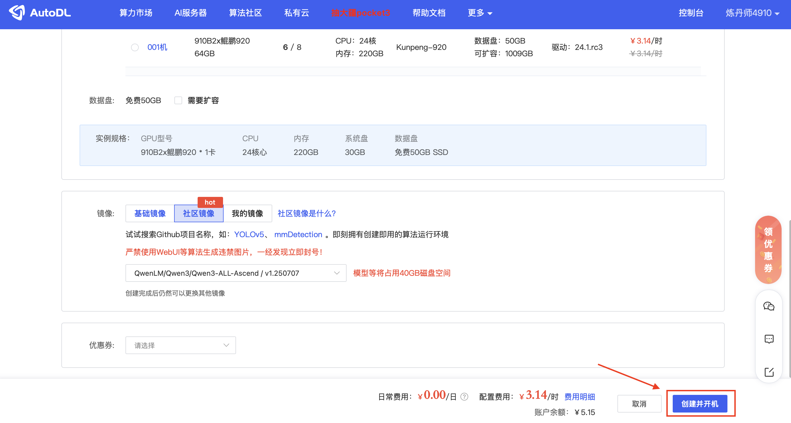
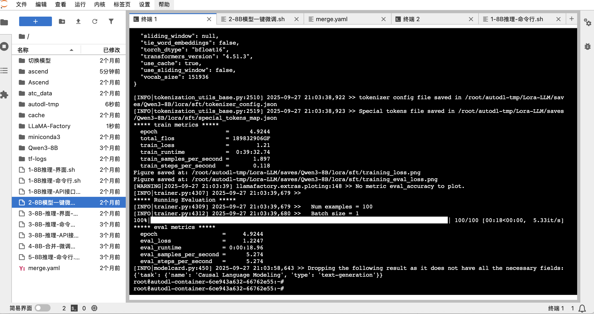

# Tutoriel de Fine-tuning et d'Inférence de Qwen3-8B sur la Plateforme Huawei Ascend (Basé sur AutoDL)

[English](README.md) | [简体中文](README.zh-CN.md) | [日本語](README.ja.md) | [Español](README.es.md) | [Français](README.fr.md)

Ceci est un guide pratique complet conçu pour aider les développeurs et les passionnés d'IA à compléter facilement l'inférence et le fine-tuning LoRA du modèle Qwen3-8B sur la plateforme AutoDL en utilisant le matériel Huawei Ascend.

Nous utiliserons l'image [Qwen3-ALL-Ascend](https://www.codewithgpu.com/i/QwenLM/Qwen3/Qwen3-ALL-Ascend) empaquetée par le contributeur de la communauté **aistudent**, qui intègre tous les environnements et scripts nécessaires, réalisant véritablement un "démarrage en un clic".

---

## Table des Matières
1. [Configuration de l'Environnement : Création d'Instance Ascend en Un Clic](#1-configuration-de-lenvironnement--création-dinstance-ascend-en-un-clic)
2. [Inférence du Modèle de Base : Découvrez la Puissance du Qwen3-8B Natif](#2-inférence-du-modèle-de-base--découvrez-la-puissance-du-qwen3-8b-natif)
3. [Fine-tuning du Modèle : Personnalisez Votre Propre Modèle avec LoRA](#3-fine-tuning-du-modèle--personnalisez-votre-propre-modèle-avec-lora)
4. [Prochaines Étapes : Valider et Utiliser le Modèle Fine-tuné](#4-prochaines-étapes--valider-et-utiliser-le-modèle-fine-tuné)

---

### 1. Configuration de l'Environnement : Création d'Instance Ascend en Un Clic

Le déploiement d'un environnement d'entraînement complexe n'a jamais été aussi facile. Nous commençons par trouver une image préconfigurée de la communauté `CodeWithGPU`.

**Étape 1 : Trouver l'Image Cible sur CodeWithGPU**
Tout d'abord, visitez la plateforme `CodeWithGPU` et recherchez `qwen3`. Dans les résultats de recherche, trouvez et sélectionnez l'image `Qwen3-ALL-Ascend` adaptée pour Huawei Ascend.


**Étape 2 : Passer à AutoDL pour Créer l'Instance**
Sur la page de détails de l'image, la configuration matérielle requise est clairement indiquée sur le côté droit. Cliquez sur le bouton **"Créer une Instance sur AutoDL"**, qui vous guidera vers la page de création préconfigurée.


**Étape 3 : Confirmer la Configuration et Lancer l'Instance**
Après le passage, vous constaterez que la page de création d'instance d'AutoDL a intelligemment sélectionné le GPU Huawei Ascend 910B, l'image appropriée et d'autres configurations pour vous. Vérifiez simplement que tout est correct et cliquez sur **"Créer et Démarrer"** dans le coin inférieur droit.



**Étape 4 : Entrer dans l'Environnement de Développement JupyterLab**
Une fois l'instance créée et démarrée avec succès (le statut passe à "En cours d'exécution"), trouvez votre instance dans le panneau "Instance de Conteneur" d'AutoDL et cliquez sur **"JupyterLab"**. C'est le point d'entrée principal pour toutes nos opérations.


**Étape 5 : Ouvrir le Terminal**
Après être entré dans JupyterLab, ouvrez un Terminal. Vous verrez une interface de bienvenue contenant des informations sur les ressources système de l'environnement actuel, confirmant que le GPU est de type **Ascend**.


À ce stade, notre environnement de développement est prêt !

### 2. Inférence du Modèle de Base : Découvrez la Puissance du Qwen3-8B Natif

Avant le fine-tuning, expérimentons les capacités conversationnelles du modèle de base. L'auteur de l'image a préparé un script de démarrage en un clic pour nous.

Tout d'abord, nous pouvons utiliser la commande `ls` pour voir les fichiers dans le répertoire actuel et nous familiariser avec l'environnement :
```bash
root@autodl-container-6ce943a632-ed7347c0:~# ls
1-8B推理-API接口.sh   2-8B模型一键微调.sh          3-8B-推理-界面-微调后.sh  Ascend         ascend      cache       tf-logs
1-8B推理-命令行.sh    3-8B-推理-API接口-微调后.sh  4-8B-合并-微调后.sh       LLaMA-Factory  atc_data    merge.yaml  切换模型
1-8B推理-界面.sh      3-8B-推理-命令行-微调后.sh   5-8B推理-命令行.sh        Qwen3-8B       autodl-tmp  miniconda3
```

Exécutez la commande suivante pour démarrer le programme de chat en ligne de commande :
```bash
./1-8B推理-命令行.sh 
```
Le script chargera automatiquement le modèle. Veuillez patienter jusqu'à ce que le chargement du journal soit terminé et que l'invite **`User:`** apparaisse.


Maintenant, vous pouvez commencer à discuter avec le modèle. Il peut non seulement participer à des conversations quotidiennes, mais aussi accomplir des tâches de codage complexes.
Par exemple, nous pouvons lui demander d'écrire du code Python pour le jeu de données `iris` :


Après l'expérience, appuyez sur `Ctrl + C` pour quitter le programme de chat.

### 3. Fine-tuning du Modèle : Personnalisez Votre Propre Modèle avec LoRA

Vient ensuite la partie passionnante : faire le fine-tuning du modèle avec nos propres données. Ici, nous utilisons le framework `LLaMA-Factory` et la technologie LoRA pour un fine-tuning efficace.

**Explication du Script de Fine-tuning**
Le contenu du script `2-8B模型一键微调.sh` dans l'image est le suivant. Il configure tous les paramètres requis pour le fine-tuning, tels que le chemin du modèle, l'ensemble de données, le répertoire de sortie, le taux d'apprentissage, etc.

```shell
cd /root/LLaMA-Factory/
llamafactory-cli train \
    --stage sft \
    --do_train \
    --model_name_or_path /root/Qwen3-8B \
    --dataset distill_psychology-10k-r1 \
    --dataset_dir /root/LLaMA-Factory/data \
    --template qwen3 \
    --finetuning_type lora \
    --output_dir /root/autodl-tmp/Lora-LLM/saves/Qwen3-8B/lora/sft \
    --overwrite_cache \
    --overwrite_output_dir \
    --cutoff_len 1024 \
    --preprocessing_num_workers 16 \
    --per_device_train_batch_size 2 \
    --per_device_eval_batch_size 1 \
    --gradient_accumulation_steps 8 \
    --lr_scheduler_type cosine \
    --logging_steps 50 \
    --warmup_steps 20 \
    --save_steps 100 \
    --eval_steps 50 \
    --eval_strategy steps \
    --load_best_model_at_end \
    --learning_rate 5e-5 \
    --num_train_epochs 5.0 \
    --max_samples 1000 \
    --val_size 0.1 \
    --plot_loss \
    --fp16
```

> **Conseil** : Vous pouvez utiliser votre propre ensemble de données en modifiant le paramètre `--dataset`. Placez simplement votre fichier d'ensemble de données dans le répertoire `/root/LLaMA-Factory/data` et ajoutez la configuration correspondante dans le fichier `dataset_info.json` de ce répertoire.

**Démarrer le Fine-tuning**
Exécutez la commande suivante dans le terminal pour démarrer le processus de fine-tuning :
```bash
./2-8B模型一键微调.sh
```
Après le début de l'entraînement, vous verrez une sortie de journal détaillée, incluant la progression de l'entraînement, les changements de perte, etc.



**Visualiser les Résultats de l'Entraînement**
Étant donné que nous avons ajouté le paramètre `--plot_loss` dans le script, le framework générera automatiquement un graphique de courbe de perte après la fin de l'entraînement. À partir du graphique, nous pouvons voir intuitivement que `eval_loss` diminue régulièrement à mesure que les étapes d'entraînement augmentent, prouvant que notre fine-tuning est efficace.


### 4. Prochaines Étapes : Valider et Utiliser le Modèle Fine-tuné

Une fois le fine-tuning terminé, les fichiers de poids LoRA ont été enregistrés dans le répertoire `--output_dir` spécifié dans le script.

Maintenant, vous pouvez utiliser le script `3-8B-推理-命令行-微调后.sh` pour charger le modèle de base et vos poids LoRA, discuter avec votre modèle **personnalisé** et tester ses nouvelles capacités !

---

Félicitations ! Vous avez terminé avec succès l'inférence et le fine-tuning du modèle Qwen3-8B sur la plateforme Huawei Ascend. J'espère que ce tutoriel ouvrira la porte à votre voyage d'exploration des grands modèles de langage.
