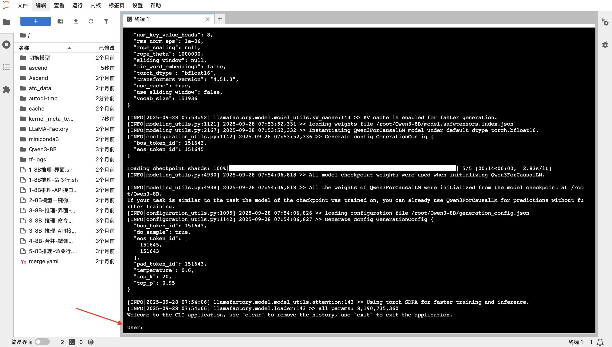

# Qwen3-8B Huawei Ascendプラットフォームでのファインチューニングと推論チュートリアル（AutoDLベース）

[English](README.md) | [简体中文](README.zh-CN.md) | [日本語](README.ja.md) | [Español](README.es.md) | [Français](README.fr.md)

本ガイドは、開発者やAI愛好家がAutoDLプラットフォーム上でHuawei Ascendハードウェアを使用し、Qwen3-8Bモデルの推論とLoRAファインチューニングを簡単に完了できるよう支援する包括的な実践ガイドです。

コミュニティ貢献者 **aistudent** がパッケージ化した [Qwen3-ALL-Ascend](https://www.codewithgpu.com/i/QwenLM/Qwen3/Qwen3-ALL-Ascend) イメージを使用します。このイメージには必要な環境とスクリプトがすべて統合されており、真の「ワンクリック起動」を実現しています。

---

## 目次
1. [環境準備：Ascendインスタンスのワンクリック作成](#1-環境準備ascendインスタンスのワンクリック作成)
2. [基本モデル推論：ネイティブQwen3-8Bの強力な能力を体験](#2-基本モデル推論ネイティブqwen3-8bの強力な能力を体験)
3. [モデルファインチューニング：LoRAで独自のモデルをカスタマイズ](#3-モデルファインチューニングloraで独自のモデルをカスタマイズ)
4. [次のステップ：ファインチューニング済みモデルの検証と使用](#4-次のステップファインチューニング済みモデルの検証と使用)

---

### 1. 環境準備：Ascendインスタンスのワンクリック作成

複雑なトレーニング環境のデプロイがこれほど簡単になったことはありません。`CodeWithGPU`コミュニティから事前設定済みのイメージを見つけることから始めます。

**ステップ1：CodeWithGPUでターゲットイメージを見つける**
まず、`CodeWithGPU`プラットフォームにアクセスし、`qwen3`を検索します。検索結果から、Huawei Ascend用に適応された`Qwen3-ALL-Ascend`イメージを見つけて選択します。


**ステップ2：AutoDLにジャンプしてインスタンスを作成**
イメージの詳細ページで、必要なハードウェア構成が右側に明確に表示されています。**「AutoDLでインスタンスを作成」**ボタンをクリックすると、事前設定された作成ページに誘導されます。


**ステップ3：構成を確認してインスタンスを起動**
ジャンプ後、AutoDLのインスタンス作成ページがHuawei Ascend 910B GPU、適切なイメージ、その他の構成を自動的に選択していることがわかります。すべてが正しいことを確認したら、右下の**「作成して起動」**をクリックするだけです。


**ステップ4：JupyterLab開発環境に入る**
インスタンスが正常に作成され起動した後（ステータスが「実行中」に変わる）、AutoDLの「コンテナインスタンス」パネルでインスタンスを見つけ、**「JupyterLab」**をクリックします。これがすべての操作の主要なエントリポイントです。


**ステップ5：ターミナルを開く**
JupyterLabに入った後、ターミナルを開きます。現在の環境のシステムリソース情報を含むウェルカム画面が表示され、GPUが**Ascend**タイプであることが確認できます。


これで開発環境の準備が整いました！

### 2. 基本モデル推論：ネイティブQwen3-8Bの強力な能力を体験

ファインチューニングの前に、基本モデルの会話能力を体験してみましょう。イメージ作成者がワンクリック起動スクリプトを用意してくれています。

まず、`ls`コマンドを使用して現在のディレクトリのファイルを表示し、環境に慣れましょう：
```bash
root@autodl-container-6ce943a632-ed7347c0:~# ls
1-8B推理-API接口.sh   2-8B模型一键微调.sh          3-8B-推理-界面-微调后.sh  Ascend         ascend      cache       tf-logs
1-8B推理-命令行.sh    3-8B-推理-API接口-微调后.sh  4-8B-合并-微调后.sh       LLaMA-Factory  atc_data    merge.yaml  切换模型
1-8B推理-界面.sh      3-8B-推理-命令行-微调后.sh   5-8B推理-命令行.sh        Qwen3-8B       autodl-tmp  miniconda3
```

次のコマンドを実行してコマンドラインチャットプログラムを起動します：
```bash
./1-8B推理-命令行.sh 
```
スクリプトは自動的にモデルをロードします。ログのロードが完了し、**`User:`**プロンプトが表示されるまでお待ちください。



これでモデルとチャットを始めることができます。日常会話だけでなく、複雑なコーディングタスクも完了できます。
例えば、`iris`データセットのPythonコードを書くように依頼できます：


体験後、`Ctrl + C`を押してチャットプログラムを終了します。

### 3. モデルファインチューニング：LoRAで独自のモデルをカスタマイズ

次はエキサイティングな部分です—独自のデータでモデルをファインチューニングします。ここでは`LLaMA-Factory`フレームワークとLoRA技術を使用して効率的なファインチューニングを行います。

**ファインチューニングスクリプトの説明**
イメージ内の`2-8B模型一键微调.sh`スクリプトの内容は以下の通りです。モデルパス、データセット、出力ディレクトリ、学習率など、ファインチューニングに必要なすべてのパラメータが設定されています。

```shell
cd /root/LLaMA-Factory/
llamafactory-cli train \
    --stage sft \
    --do_train \
    --model_name_or_path /root/Qwen3-8B \
    --dataset distill_psychology-10k-r1 \
    --dataset_dir /root/LLaMA-Factory/data \
    --template qwen3 \
    --finetuning_type lora \
    --output_dir /root/autodl-tmp/Lora-LLM/saves/Qwen3-8B/lora/sft \
    --overwrite_cache \
    --overwrite_output_dir \
    --cutoff_len 1024 \
    --preprocessing_num_workers 16 \
    --per_device_train_batch_size 2 \
    --per_device_eval_batch_size 1 \
    --gradient_accumulation_steps 8 \
    --lr_scheduler_type cosine \
    --logging_steps 50 \
    --warmup_steps 20 \
    --save_steps 100 \
    --eval_steps 50 \
    --eval_strategy steps \
    --load_best_model_at_end \
    --learning_rate 5e-5 \
    --num_train_epochs 5.0 \
    --max_samples 1000 \
    --val_size 0.1 \
    --plot_loss \
    --fp16
```

> **ヒント**：`--dataset`パラメータを変更することで、独自のデータセットを使用できます。データセットファイルを`/root/LLaMA-Factory/data`ディレクトリに配置し、そのディレクトリの`dataset_info.json`ファイルに対応する設定を追加するだけです。

**ファインチューニングの開始**
ターミナルで次のコマンドを実行してファインチューニングプロセスを開始します：
```bash
./2-8B模型一键微调.sh
```
トレーニングが開始されると、トレーニングの進行状況、損失の変化などを含む詳細なログ出力が表示されます。


**トレーニング結果の可視化**
スクリプトに`--plot_loss`パラメータを追加したため、トレーニング完了後、フレームワークは自動的に損失曲線グラフを生成します。グラフから、トレーニングステップの増加に伴い`eval_loss`が着実に減少していることが直感的にわかり、ファインチューニングが効果的であることが証明されます。


### 4. 次のステップ：ファインチューニング済みモデルの検証と使用

ファインチューニングが完了すると、LoRA重みファイルはスクリプトで指定された`--output_dir`ディレクトリに保存されます。

これで、`3-8B-推理-命令行-微调后.sh`スクリプトを使用して基本モデルとLoRA重みをロードし、**カスタムチューニング済み**モデルとチャットして、その新しい能力をテストできます！

---

おめでとうございます！Huawei AscendプラットフォームでQwen3-8Bモデルの推論とファインチューニングを正常に完了しました。このチュートリアルが大規模言語モデル探索の旅への扉を開くことを願っています。
