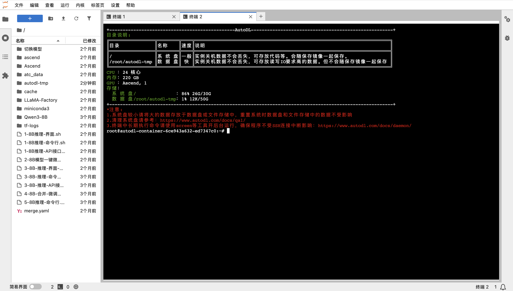
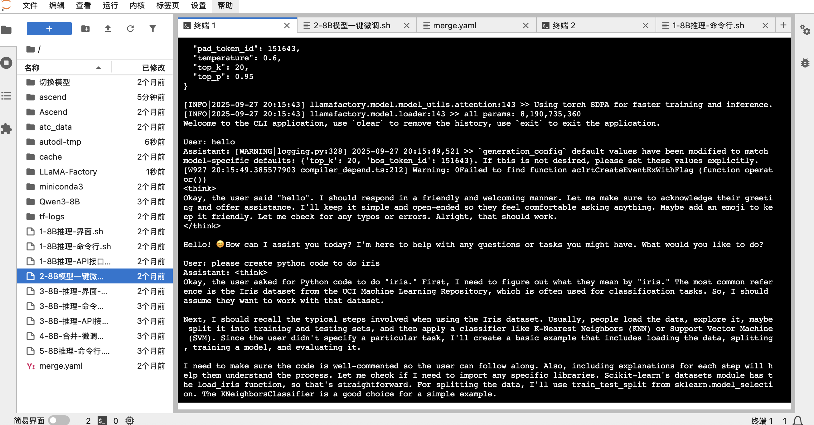

# Qwen3-8B 在华为昇腾平台上的保姆级微调与推理教程 (基于AutoDL)

本文是一篇详尽的实践指南，旨在帮助开发者和AI爱好者在AutoDL平台上，利用华为昇腾（Ascend）硬件，轻松完成对 Qwen3-8B 模型的推理和LoRA微调。

我们将使用由社区贡献者 **aistudent** 封装的 [Qwen3-ALL-Ascend](https://www.codewithgpu.com/i/QwenLM/Qwen3/Qwen3-ALL-Ascend) 镜像，它集成了所有必要的环境和脚本，真正实现“一键启动”。

---

## 目录
1.  [环境准备：一键创建昇腾实例](#1-环境准备一键创建昇腾实例)
2.  [基础模型推理：体验原生Qwen3-8B的强大能力](#2-基础模型推理体验原生qwen3-8b的强大能力)
3.  [模型微调：使用LoRA定制你自己的模型](#3-模型微调使用lora定制你自己的模型)
4.  [后续步骤：验证并使用微调后的模型](#4-后续步骤验证并使用微调后的模型)

---

### 1. 环境准备：一键创建昇腾实例

部署一个复杂的炼丹环境从未如此简单。我们从 `CodeWithGPU` 社区找到已经配置好一切的镜像开始。

**步骤 1：在 CodeWithGPU 找到目标镜像**
首先，访问 `CodeWithGPU` 平台，搜索 `qwen3`。在搜索结果中，找到并选择适配华为昇腾（Ascend）的 `Qwen3-ALL-Ascend` 镜像。


**步骤 2：跳转到 AutoDL 创建实例**
在镜像详情页，页面右侧清晰地标明了所需的硬件配置。直接点击 **“AutoDL创建实例”** 按钮，它将引导我们进入预设好配置的创建页面。


**步骤 3：确认配置并启动实例**
跳转后，你会发现AutoDL的实例创建页面已经为你智能地选择了华为昇腾910B的GPU、合适的镜像以及其他配置。你只需检查无误后，点击右下角的 **“创建并开机”** 即可。


**步骤 4：进入JupyterLab开发环境**
实例创建并开机成功后（状态变为“运行中”），在AutoDL的“容器实例”面板中，找到你的实例，并点击 **“JupyterLab”**。这是我们进行所有操作的主要入口。


**步骤 5：打开终端**
进入JupyterLab后，打开一个终端（Terminal）。你会看到一个欢迎界面，其中包含了当前环境的系统资源信息，确认GPU为 **Ascend** 类型。



至此，我们的开发环境已经准备就绪！

### 2. 基础模型推理：体验原生Qwen3-8B的强大能力

在微调之前，让我们先来体验一下基础模型的对话能力。镜像作者已经为我们准备好了一键启动脚本。

首先，我们可以使用 `ls` 命令查看当前目录下的文件，熟悉一下环境：
```bash
root@autodl-container-6ce943a632-ed7347c0:~# ls
1-8B推理-API接口.sh   2-8B模型一键微调.sh          3-8B-推理-界面-微调后.sh  Ascend         ascend      cache       tf-logs
1-8B推理-命令行.sh    3-8B-推理-API接口-微调后.sh  4-8B-合并-微调后.sh       LLaMA-Factory  atc_data    merge.yaml  切换模型
1-8B推理-界面.sh      3-8B-推理-命令行-微调后.sh   5-8B推理-命令行.sh        Qwen3-8B       autodl-tmp  miniconda3
```

执行以下命令来启动命令行对话程序：
```bash
./1-8B推理-命令行.sh 
```
脚本会自动加载模型。请耐心等待，直到日志加载完成，并出现 **`User:`** 提示符。


现在，你可以开始和模型进行对话了。它不仅能进行日常聊天，还能完成复杂的编码任务。
例如，我们可以让它编写一个关于`iris`数据集的Python代码：



体验完成后，按 `Ctrl + C` 退出对话程序。

### 3. 模型微调：使用LoRA定制你自己的模型

接下来是激动人心的环节——使用我们自己的数据对模型进行微调。这里我们使用 `LLaMA-Factory` 框架和 LoRA 技术进行高效微调。

**微调脚本详解**
镜像中 `2-8B模型一键微调.sh` 脚本的内容如下。它配置了所有微调所需的参数，例如模型路径、数据集、输出目录、学习率等。

```shell
cd /root/LLaMA-Factory/
llamafactory-cli train \
    --stage sft \
    --do_train \
    --model_name_or_path /root/Qwen3-8B \
    --dataset distill_psychology-10k-r1 \
    --dataset_dir /root/LLaMA-Factory/data \
    --template qwen3 \
    --finetuning_type lora \
    --output_dir /root/autodl-tmp/Lora-LLM/saves/Qwen3-8B/lora/sft \
    --overwrite_cache \
    --overwrite_output_dir \
    --cutoff_len 1024 \
    --preprocessing_num_workers 16 \
    --per_device_train_batch_size 2 \
    --per_device_eval_batch_size 1 \
    --gradient_accumulation_steps 8 \
    --lr_scheduler_type cosine \
    --logging_steps 50 \
    --warmup_steps 20 \
    --save_steps 100 \
    --eval_steps 50 \
    --eval_strategy steps \
    --load_best_model_at_end \
    --learning_rate 5e-5 \
    --num_train_epochs 5.0 \
    --max_samples 1000 \
    --val_size 0.1 \
    --plot_loss \
    --fp16
```

> **提示**：你可以通过修改 `--dataset` 参数来使用自己的数据集。只需将你的数据集文件放到 `/root/LLaMA-Factory/data` 目录下，并在该目录的 `dataset_info.json` 中添加相应配置即可。

**开始微调**
在终端中执行以下命令启动微调过程：
```bash
./2-8B模型一键微调.sh
```
训练开始后，你会看到详细的日志输出，包括训练进度、loss变化等。


**可视化训练结果**
由于我们在脚本中添加了 `--plot_loss` 参数，训练完成后，框架会自动生成一张损失曲线图。从图中我们可以直观地看到 `eval_loss` 随着训练步数的增加而稳步下降，证明我们的微调是有效的。


### 4. 后续步骤：验证并使用微调后的模型

微调完成后，LoRA权重文件已保存在脚本指定的 `--output_dir` 目录中。

现在，你可以使用 `3-8B-推理-命令行-微调后.sh` 脚本来加载基础模型和你的LoRA权重，与你**专属定制**后的模型进行对话，检验它的新能力！

---

恭喜你！你已经成功在华为昇腾平台上完成了对Qwen3-8B模型的推理和微调。希望这篇教程能为你打开大模型探索之旅的大门。