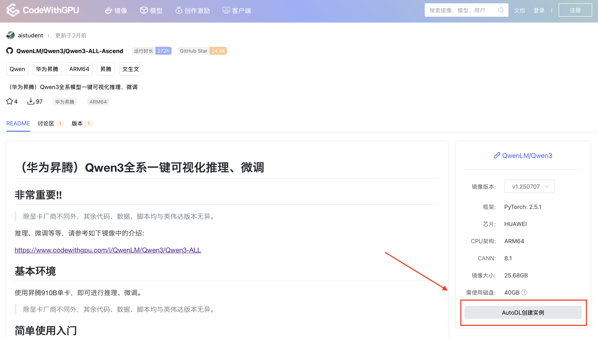
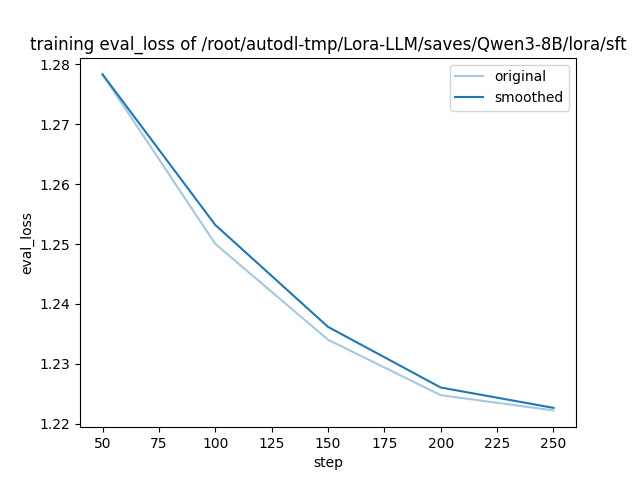

# Qwen3-8B Fine-tuning and Inference Tutorial on Huawei Ascend Platform (Based on AutoDL)

[English](README.md) | [简体中文](README.zh-CN.md) | [日本語](README.ja.md) | [Español](README.es.md) | [Français](README.fr.md)

This is a comprehensive practical guide designed to help developers and AI enthusiasts easily complete inference and LoRA fine-tuning of the Qwen3-8B model on the AutoDL platform using Huawei Ascend hardware.

We will use the [Qwen3-ALL-Ascend](https://www.codewithgpu.com/i/QwenLM/Qwen3/Qwen3-ALL-Ascend) image packaged by community contributor **aistudent**, which integrates all necessary environments and scripts, truly achieving "one-click startup".

---

## Table of Contents
1. [Environment Setup: One-Click Creation of Ascend Instance](#1-environment-setup-one-click-creation-of-ascend-instance)
2. [Base Model Inference: Experience the Power of Native Qwen3-8B](#2-base-model-inference-experience-the-power-of-native-qwen3-8b)
3. [Model Fine-tuning: Customize Your Own Model with LoRA](#3-model-fine-tuning-customize-your-own-model-with-lora)
4. [Next Steps: Validate and Use the Fine-tuned Model](#4-next-steps-validate-and-use-the-fine-tuned-model)

---

### 1. Environment Setup: One-Click Creation of Ascend Instance

Deploying a complex training environment has never been easier. We start by finding a pre-configured image from the `CodeWithGPU` community.

**Step 1: Find the Target Image on CodeWithGPU**
First, visit the `CodeWithGPU` platform and search for `qwen3`. In the search results, find and select the `Qwen3-ALL-Ascend` image adapted for Huawei Ascend.


**Step 2: Jump to AutoDL to Create Instance**
On the image details page, the required hardware configuration is clearly marked on the right side. Click the **"Create Instance on AutoDL"** button, which will guide you to the pre-configured creation page.



**Step 3: Confirm Configuration and Launch Instance**
After jumping, you'll find that AutoDL's instance creation page has intelligently selected the Huawei Ascend 910B GPU, appropriate image, and other configurations for you. Simply check that everything is correct and click **"Create and Start"** in the lower right corner.


**Step 4: Enter JupyterLab Development Environment**
After the instance is successfully created and started (status changes to "Running"), find your instance in AutoDL's "Container Instance" panel and click **"JupyterLab"**. This is the main entry point for all our operations.


**Step 5: Open Terminal**
After entering JupyterLab, open a Terminal. You'll see a welcome interface containing system resource information for the current environment, confirming that the GPU is of **Ascend** type.


At this point, our development environment is ready!

### 2. Base Model Inference: Experience the Power of Native Qwen3-8B

Before fine-tuning, let's experience the conversational capabilities of the base model. The image author has prepared a one-click startup script for us.

First, we can use the `ls` command to view files in the current directory and familiarize ourselves with the environment:
```bash
root@autodl-container-6ce943a632-ed7347c0:~# ls
1-8B推理-API接口.sh   2-8B模型一键微调.sh          3-8B-推理-界面-微调后.sh  Ascend         ascend      cache       tf-logs
1-8B推理-命令行.sh    3-8B-推理-API接口-微调后.sh  4-8B-合并-微调后.sh       LLaMA-Factory  atc_data    merge.yaml  切换模型
1-8B推理-界面.sh      3-8B-推理-命令行-微调后.sh   5-8B推理-命令行.sh        Qwen3-8B       autodl-tmp  miniconda3
```

Execute the following command to start the command-line chat program:
```bash
./1-8B推理-命令行.sh 
```
The script will automatically load the model. Please be patient until the log loading is complete and the **`User:`** prompt appears.


Now you can start chatting with the model. It can not only engage in daily conversations but also complete complex coding tasks.
For example, we can ask it to write Python code for the `iris` dataset:


After experiencing, press `Ctrl + C` to exit the chat program.

### 3. Model Fine-tuning: Customize Your Own Model with LoRA

Next comes the exciting part—fine-tuning the model with our own data. Here we use the `LLaMA-Factory` framework and LoRA technology for efficient fine-tuning.

**Fine-tuning Script Explanation**
The content of the `2-8B模型一键微调.sh` script in the image is as follows. It configures all parameters required for fine-tuning, such as model path, dataset, output directory, learning rate, etc.

```shell
cd /root/LLaMA-Factory/
llamafactory-cli train \
    --stage sft \
    --do_train \
    --model_name_or_path /root/Qwen3-8B \
    --dataset distill_psychology-10k-r1 \
    --dataset_dir /root/LLaMA-Factory/data \
    --template qwen3 \
    --finetuning_type lora \
    --output_dir /root/autodl-tmp/Lora-LLM/saves/Qwen3-8B/lora/sft \
    --overwrite_cache \
    --overwrite_output_dir \
    --cutoff_len 1024 \
    --preprocessing_num_workers 16 \
    --per_device_train_batch_size 2 \
    --per_device_eval_batch_size 1 \
    --gradient_accumulation_steps 8 \
    --lr_scheduler_type cosine \
    --logging_steps 50 \
    --warmup_steps 20 \
    --save_steps 100 \
    --eval_steps 50 \
    --eval_strategy steps \
    --load_best_model_at_end \
    --learning_rate 5e-5 \
    --num_train_epochs 5.0 \
    --max_samples 1000 \
    --val_size 0.1 \
    --plot_loss \
    --fp16
```

> **Tip**: You can use your own dataset by modifying the `--dataset` parameter. Simply place your dataset file in the `/root/LLaMA-Factory/data` directory and add the corresponding configuration in the `dataset_info.json` file in that directory.

**Start Fine-tuning**
Execute the following command in the terminal to start the fine-tuning process:
```bash
./2-8B模型一键微调.sh
```
After training starts, you'll see detailed log output, including training progress, loss changes, etc.


**Visualize Training Results**
Since we added the `--plot_loss` parameter in the script, the framework will automatically generate a loss curve chart after training is complete. From the chart, we can intuitively see that `eval_loss` steadily decreases as training steps increase, proving that our fine-tuning is effective.



### 4. Next Steps: Validate and Use the Fine-tuned Model

After fine-tuning is complete, the LoRA weight files have been saved in the `--output_dir` directory specified in the script.

Now you can use the `3-8B-推理-命令行-微调后.sh` script to load the base model and your LoRA weights, chat with your **custom-tuned** model, and test its new capabilities!

---

Congratulations! You have successfully completed inference and fine-tuning of the Qwen3-8B model on the Huawei Ascend platform. I hope this tutorial opens the door to your journey of exploring large language models.
